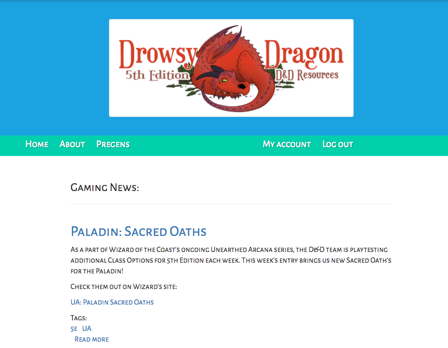

# Drowsy Dragon
A 5th Edition Dungeons & Dragons Content Site

## Description
A Drupal Website to Manage Dungeons and Dragons 5th Edition Resources. This project uses a custom theme and is currently a work in progress.

## Technologies

Drupal, PHP, SQL, and Bootstrap.

## Usage

To use the code, you can clone the repository at [https://github.com/jryanconklin/drowsydragon](https://github.com/jryanconklin/drowsydragon).
To view the site, you can go to [http://drowsydragon.com/](http://drowsydragon.com/).

For best results, please:

- Clone the Repository
- Port the Provided "drowsydr_drupal294.sql.zip" Database to Your SQL Provider
- Launch Project in Server Mode via MAMP, LAMP or WAMP

* Note that you will need a password to use this project. If you'd like to experiment with this project, please contact me via GitHub for details.

## User Stories

* As a User, I want to find pre-generated character sheets to use quickly.

* As a User, I want to have a source for 5th Edition D&D gaming news.

## Current Bugs

* None known at this time. If you find one, please let me know!

## Authors
J. Ryan Conklin

##License
This work can be used under the MIT License.
Copyright (c) 2017 J. Ryan Conklin
